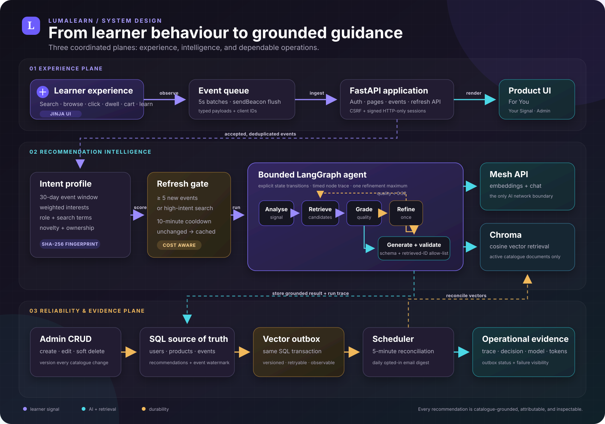

<div align="center">

<sub><strong>SMARTRECO BUILD CHALLENGE 2026</strong></sub>

# LumaLearn

### Behaviour becomes a learning path.

LumaLearn is an explainable AI course marketplace that learns from real learner intent,
retrieves only genuine catalogue items, and turns them into grounded recommendations.

[](https://lumalearn-smartreco.onrender.com)
[](https://github.com/nitesh0007-edith/smartreco-lumalearn/actions/workflows/test.yml)
[](https://github.com/nitesh0007-edith/smartreco-lumalearn/actions/workflows/smartreco-checks.yml)
[](https://www.python.org/)
[](https://fastapi.tiangolo.com/)
[](https://langchain-ai.github.io/langgraph/)
[](LICENSE)

[**Launch the live experience**](https://lumalearn-smartreco.onrender.com) ·
[**Explore the architecture**](#architecture) ·
[**Run locally**](#run-locally) ·
[**Review the tests**](#quality-gates)

</div>

> [!IMPORTANT]
> Every AI operation—including catalogue and query embeddings—passes through
> **Mesh API**. The application has no provider-direct endpoint, local embedding model,
> fabricated recommendation fallback, or hardcoded “related courses” list.

## At a glance

| | |
|---|---|
| **Live application** | [lumalearn-smartreco.onrender.com](https://lumalearn-smartreco.onrender.com) |
| **Personalisation input** | Search, catalogue/category views, product views, clicks, active dwell, cart, purchase, and recommendation feedback |
| **Agent** | Bounded LangGraph: analyse → retrieve → grade → refine once → generate |
| **AI gateway** | Mesh API for `openai/text-embedding-3-small` and `openai/gpt-4o-mini` |
| **Retrieval** | Persistent Chroma cosine search over 36 seeded catalogue courses |
| **Grounding** | Structured output plus a retrieved-product ID allow-list before persistence |
| **Reliability** | SQL/vector transactional outbox, reconciliation scheduler, fingerprints, cooldowns, and retained traces |
| **Delivery** | Personalised marketplace UI, learner-facing signal explanation, admin operations, and optional email digest |

## The product idea

Most recommendation widgets begin with a category and end with a static “you may also
like” list. LumaLearn begins with evidence. It watches how a signed-in learner explores
the catalogue, converts those actions into a weighted 30-day intent profile, retrieves
semantically relevant courses, and asks a bounded agent to explain a useful next step.

That distinction produces five important guarantees:

| Invariant | What LumaLearn enforces |
|---|---|
| **No invented products** | The model sees retrieved candidates only; returned IDs must pass the retrieval allow-list. |
| **No AI call on every click** | Event thresholds, high-intent detection, a ten-minute cooldown, and a behaviour fingerprint gate refreshes. |
| **No silent vector drift** | Product writes and versioned vector jobs commit in the same SQL transaction. |
| **No invisible reasoning trail** | Run decision, node timings, model, token usage, trace ID, and source-event watermark are retained. |
| **No hidden provider bypass** | One validated Mesh gateway owns both embeddings and language generation. |

## Judge-ready live flow

The strongest demonstration uses two accounts so account isolation is visible:

1. Begin with the existing administrator and open `/admin` to show catalogue/vector
   state, outbox jobs, learners, and agent runs.
2. Log out and register a completely new learner with a target role.
3. Search for `agent planning`, open a relevant course, and spend a few seconds on it.
4. Search for `production RAG`, inspect another course, and allow the event batch to flush.
5. Open `/for-you` and refresh from the learner's signal if the background run is still pending.
6. Open `/your-signal` to connect the recommendation to interests, event watermark,
   trace, decision, model, and token evidence.

The recommendation can start automatically after five new events, or after two new
events when the profile contains a high-intent search. An explicit refresh is available
for a controlled live demo.

## Architecture

The system is organised into three planes: a non-blocking learner experience,
bounded recommendation intelligence, and a durability/observability plane. Click the
diagram to open the full-resolution version.

<p align="center">
  <a href="docs/architecture.svg">
    
  </a>
</p>

### Request lifecycle

```mermaid
sequenceDiagram
    autonumber
    actor Learner
    participant Browser as Browser event queue
    participant API as FastAPI
    participant SQL as SQL source of truth
    participant Graph as LangGraph agent
    participant Mesh as Mesh API
    participant Chroma as Chroma

    Learner->>Browser: search + view + click + active dwell
    Browser->>API: POST /api/events/batch
    API->>SQL: validate, deduplicate, persist
    API-->>Learner: navigation remains non-blocking
    API->>SQL: evaluate threshold + cooldown + fingerprint
    API->>Graph: meaningful signal refresh
    Graph->>SQL: build weighted intent profile
    Graph->>Mesh: embed behaviour query
    Mesh-->>Graph: query vector
    Graph->>Chroma: retrieve active catalogue candidates
    Chroma-->>Graph: cosine-ranked product IDs
    Graph->>Graph: rerank + grade; refine at most once
    Graph->>Mesh: generate from candidate allow-list
    Mesh-->>Graph: structured recommendation JSON
    Graph->>Graph: Pydantic schema + product-ID validation
    Graph->>SQL: recommendation + ranks + trace + watermark
    SQL-->>Learner: For You + Your Signal
```

### The bounded agent

The graph has explicit transitions rather than an open-ended tool loop:

```text
START
  └─ analyse weighted behaviour
       ├─ insufficient signal ───────────────────────────────→ END
       └─ retrieve candidates using a Mesh query embedding
            └─ grade retrieval quality
                 ├─ weak and not yet refined → refine once → retrieve
                 ├─ no active candidates ───────────────────→ END
                 └─ generate from retrieved candidates only
                      └─ validate schema + candidate IDs → persist → END
```

Each node appends its duration and decision details to the run trace. Refinement is
bounded to one pass, which keeps latency and spend predictable.

## What makes the implementation different

### 1. Behaviour is weighted, bounded, and attributable

The browser records meaningful interactions without blocking the learner. Events are
queued, sent every five seconds in batches of at most 50, deduplicated by
`(user_id, client_event_id)`, and flushed with `sendBeacon` during navigation. Only
bounded scalar metadata is stored, and at most 120 recent events from the last 30 days
feed a recommendation profile.

| Event | Weight | Interpretation |
|---|---:|---|
| Catalogue view | 0.5 | Weak discovery signal |
| Category view | 1.0 | Broad area of interest |
| Product view | 2.0 | Consideration |
| Product click | 3.0 | Deliberate selection |
| Cart add | 3.5 | Commercial/learning intent |
| Recommendation click | 4.0 | Strong positive feedback |
| Search | 4.0 | Explicitly stated intent |
| Purchase | 5.0 | Confirmed commitment |
| Active dwell | 0.5–5.0 | Scales with active time and is capped |

The resulting profile includes target role, top searches, categories, topics, viewed
items, cart items, purchases, weighted intent, an event watermark, and a SHA-256
behaviour fingerprint.

### 2. Retrieval and generation are grounded by construction

`app/services/mesh_gateway.py` is the single AI boundary. LumaLearn uses it to embed
catalogue documents and learner queries, then retrieves active products from Chroma.
Results are re-ranked using semantic similarity, category affinity, role fit, novelty,
cart intent, and purchase exclusion.

The generation prompt receives only those candidates. Its JSON is parsed into a typed
Pydantic schema, every product ID is compared with the candidate allow-list, duplicates
are removed, and a result with no valid retrieved products fails rather than inventing a
fallback.

### 3. Catalogue and vectors cannot silently diverge

Create, edit, and soft-delete operations update the SQL product and insert a versioned
`vector_sync_jobs` row in one transaction. An immediate worker attempt handles the fast
path; APScheduler reconciles unfinished jobs every five minutes.

- Superseded product versions are skipped.
- Upserts are embedded through Mesh before reaching Chroma.
- Deletes remove the corresponding vector.
- Attempts and bounded error details remain visible in Admin.
- A manual audit/drain is available through `scripts/reconcile_vectors.py`.

This is the transactional outbox pattern applied to semantic search: the database can
commit safely even when the AI gateway or vector store is temporarily unavailable.

### 4. Explainability is a product surface

`/your-signal` is not a developer log. It lets a learner see the high-level interests
the system inferred, while operators can inspect the corresponding run in `/admin`.
Stored evidence includes:

- activity fingerprint and source-event watermark;
- trigger, decision, status, and per-node execution trace;
- model plus prompt/completion token counts;
- ranked products and retrieval scores;
- vector status, outbox attempts, and visible failures.

## Technology stack

| Layer | Technology | Responsibility |
|---|---|---|
| Web application | FastAPI + Jinja2 | Server-rendered marketplace, auth, API routes, and admin UI |
| Data model | SQLAlchemy + SQLite/WAL | Users, catalogue, events, carts, purchases, recommendations, jobs, and traces |
| Agent orchestration | LangGraph | Explicit analyse/retrieve/grade/refine/generate state machine |
| AI gateway | Mesh API via OpenAI-compatible client | Embeddings and structured recommendation generation |
| Semantic retrieval | Chroma | Persistent cosine search over catalogue documents |
| Validation | Pydantic | Bounded event payloads, product forms, and structured model output |
| Scheduling | APScheduler | Vector reconciliation and opted-in daily digest |
| Security | Argon2 + signed sessions + CSRF | Password hashing, authentication, and mutation protection |
| Delivery | Docker + Render Blueprint | Reproducible full-container deployment and health checks |
| Quality | pytest + Ruff + GitHub Actions | Unit, integration, security, web smoke, and challenge checks |

## Repository map

```text
.
├── app/
│   ├── routers/                 # Auth, web, admin, events, recommendation APIs
│   ├── services/
│   │   ├── agent.py             # Bounded LangGraph recommendation workflow
│   │   ├── behavior.py          # Event ingestion + weighted learner profile
│   │   ├── catalog.py           # Product mutations + vector outbox worker
│   │   ├── mesh_gateway.py      # Only AI boundary in the application
│   │   ├── recommendations.py   # Refresh gate, cache, persistence, run ledger
│   │   ├── vector_store.py      # Chroma catalogue adapter
│   │   └── email_digest.py      # Optional real SMTP delivery
│   ├── static/                  # Responsive UI + non-blocking behaviour client
│   └── templates/               # Marketplace, account, signal, and admin views
├── data/catalog.json            # 36-course seed catalogue—not recommendation output
├── docs/architecture.svg        # Full-resolution system architecture
├── scripts/                     # Admin bootstrap and vector reconciliation
├── tests/                       # 10 focused automated tests
├── Dockerfile
├── render.yaml                  # Render Blueprint used by the live deployment
└── main.py                      # ASGI entrypoint
```

## Run locally

### Prerequisites

- Python 3.11+
- A Mesh API key beginning with `rsk_`

### Setup

```bash
python -m venv .venv
source .venv/bin/activate
pip install -r requirements.txt
cp .env.example .env
```

Add local secrets to `.env`—never to the repository:

```dotenv
MESH_API_KEY=replace-with-your-rsk-key
SECRET_KEY=replace-with-a-long-random-value
```

Start the application:

```bash
uvicorn main:app --reload
```

Open [http://127.0.0.1:8000](http://127.0.0.1:8000). On first startup, the
catalogue is seeded, vector jobs are created, and catalogue documents are embedded
through Mesh before being indexed in Chroma.

To run the same container shape used in production:

```bash
docker compose up --build
```

### Create an administrator

Create a regular account in the UI, then run:

```bash
python scripts/create_admin.py --email you@example.com
```

If the user exists, the script promotes it without changing the password. If not, it
securely prompts for a new password. Production can additionally use the hashed
`ADMIN_EMAIL_HASHES` allow-list without storing an administrator address in deployment
configuration.

## Configuration

The defaults live in `app/config.py` and `.env.example` documents the supported values.

| Variable | Required | Purpose |
|---|:---:|---|
| `MESH_API_KEY` | Yes | Sponsor gateway credential for embeddings and generation |
| `SECRET_KEY` | Production | Signs the session cookie; production rejects the development default |
| `DATABASE_URL` | No | SQLAlchemy database URL; defaults to local SQLite |
| `CHROMA_PATH` | No | Persistent Chroma directory |
| `ADMIN_EMAIL_HASHES` | No | Comma-separated SHA-256 hashes for administrator allow-listing |
| `SCHEDULER_ENABLED` | No | Enables vector reconciliation and daily digest jobs |
| `DIGEST_HOUR_UTC` | No | UTC hour for opted-in email delivery |
| `SMTP_*` | No | Real SMTP transport; absent configuration is recorded as skipped |

The Mesh base URL is validated to the HTTPS `api.meshapi.ai` host, preventing an
environment override from silently bypassing the required gateway.

## Quality gates

Run the same core checks as CI:

```bash
ruff check .
python -m compileall -q app main.py scripts tests
pytest --cov=app --cov-report=term-missing
```

The 10 focused tests cover:

- account, profile, and password-reset experience;
- weighted behaviour profiling and event deduplication;
- bounded retrieval, grading, and grounded generation;
- product create/update/delete vector versioning;
- vector worker use of Mesh embeddings;
- Mesh embeddings and strict structured output;
- Argon2 password security and admin hash normalisation;
- registration and web/API smoke behaviour.

Two workflows run on GitHub:

- `.github/workflows/test.yml` runs the repository quality suite.
- `.github/workflows/smartreco-checks.yml` obtains an OIDC token and runs the official
  challenge checks without exposing submission credentials.

## Deploy on Render

[](https://render.com/deploy?repo=https://github.com/nitesh0007-edith/smartreco-lumalearn)

The supported deployment is the complete Docker container described by `render.yaml`.
Create a Blueprint from the repository, select `main`, and provide `MESH_API_KEY` when
Render requests the unsynchronised secret. Render generates `SECRET_KEY` and probes
`/api/health`.

```bash
curl https://lumalearn-smartreco.onrender.com/api/health
```

The free Render service uses ephemeral filesystem storage. It is suitable for the live
challenge demo, but accounts, SQLite data, and Chroma vectors may reset after a sleep,
restart, or redeploy. For a durable production deployment, attach a persistent disk at
`/app/data` or move SQL to PostgreSQL and vectors to a shared Chroma-compatible service.

## Security and operational posture

- Passwords are Argon2 hashed and never recoverable.
- Sessions are signed, HTTP-only, SameSite=Lax, and Secure in production.
- Every state-changing form/API request requires a per-session CSRF token.
- User-controlled payloads are typed, length-bounded, and metadata is reduced to
  bounded scalar values.
- Admin access is role-checked and can be bootstrapped through hashed email allow-listing.
- Agent errors are stored without credentials; the last good recommendation remains
  available during an upstream failure.
- Secrets belong in `.env` locally, Render environment variables in deployment, and
  GitHub Actions secrets in CI—never in source or documentation.

## Challenge repository setup

Under **GitHub → Settings → Secrets and variables → Actions**, configure:

- `MESH_API_KEY` — the private Mesh credential.
- `SUBMISSION_TOKEN` — the private token from the challenge dashboard.

The public repository URL is:

```text
https://github.com/nitesh0007-edith/smartreco-lumalearn
```

## Design trade-offs

- **SQLite + local Chroma** keep the challenge build inspectable and container-friendly,
  but require persistent storage and a single writer in durable production.
- **Server-rendered Jinja** reduces client complexity while still supporting a polished,
  responsive marketplace and non-blocking browser event transport.
- **In-process scheduling** is appropriate for one container; multiple workers should
  move reconciliation and digest scheduling to a dedicated worker or Celery Beat.
- **One bounded refinement** improves weak retrieval without creating an uncontrolled
  agent loop.

## License

Released under the [MIT License](LICENSE).

<div align="center">

**Built to make personalisation useful, grounded, and explainable.**

[Live app](https://lumalearn-smartreco.onrender.com) ·
[Architecture](docs/architecture.svg) ·
[Report an issue](https://github.com/nitesh0007-edith/smartreco-lumalearn/issues)

</div>
