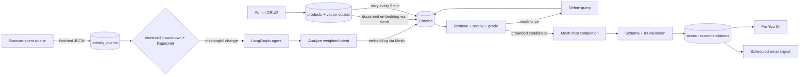

# LumaLearn — behavioral AI recommendations that earn the click

LumaLearn is a course marketplace whose recommendation agent learns from what a user actually does: searches, product views, clicks, and active time. It turns those signals into a weighted intent brief, retrieves real products from Chroma, grades and refines retrieval in LangGraph, and asks an LLM for persuasive copy that can reference only the retrieved product IDs.

Every AI operation—including embeddings—goes through **Mesh API** at `https://api.meshapi.ai/v1`. There is no direct provider SDK, local embedding model, fake recommendation, or hardcoded fallback.

Built for the **SmartReco Build Challenge 2026**.

## Why this is more than “related products”

- Behavioral intent is weighted: search and recommendation clicks count more than a passing view; active dwell scales with time.
- Events are queued client-side, sent in batches every five seconds, deduplicated by client event ID, and flushed with `sendBeacon` without blocking navigation.
- SQL catalog mutations and vector mutations are joined by a transactional outbox. If Mesh or Chroma is unavailable, synchronization is visibly pending and retried by the scheduler.
- The agent is an explicit LangGraph: `analyze → retrieve → grade → refine (at most once) → generate`.
- Retrieval uses Mesh embeddings and a real persistent Chroma collection, then re-ranks for semantic similarity, category affinity, and novelty.
- The LLM receives only retrieved catalog candidates. Strict JSON output is validated with Pydantic, product IDs are checked against the retrieval allow-list, and invalid/imagined IDs are never stored.
- Refresh gates, a ten-minute cooldown, and a behavior fingerprint cache prevent redundant AI spend.
- Recommendations, ranked items, source event watermark, model, token counts, and per-node traces are stored for inspection.
- APScheduler reconciles vector jobs every five minutes and delivers opted-in recommendations by real SMTP on a daily UTC schedule.

## Architecture



The only AI boundary is [`app/services/mesh_gateway.py`](app/services/mesh_gateway.py). Its base URL is validated so an environment override cannot point it at a provider directly.

## Stack

- **Backend:** Python 3.11, FastAPI, server-rendered Jinja2
- **Primary database:** SQLAlchemy with SQLite/WAL locally; `DATABASE_URL` is ready for another SQLAlchemy database
- **Vector database:** persistent Chroma with cosine search
- **LLM and embeddings:** OpenAI Python client pointed exclusively at Mesh API
- **Agent:** LangGraph with bounded retrieval refinement
- **Scheduler:** APScheduler
- **Auth/security:** signed HTTP-only sessions, Argon2 password hashing, CSRF tokens, secure headers
- **Testing:** pytest, fake boundary clients, Ruff, compile checks

## Run locally

Prerequisites: Python 3.11+ and a Mesh key beginning with `rsk_`.

```bash
python -m venv .venv
source .venv/bin/activate
pip install -r requirements.txt
cp .env.example .env
```

Put your Mesh key in the local `.env`:

```dotenv
MESH_API_KEY=replace-with-your-rsk-key
SECRET_KEY=replace-with-a-long-random-value
```

Start the app:

```bash
uvicorn main:app --reload
```

Open <http://127.0.0.1:8000>. Twelve realistic courses are inserted on the first run and queued for Mesh embedding plus Chroma indexing. The `.env`, SQLite database, and Chroma files are gitignored.

Create a regular account in the UI. To make it an admin securely:

```bash
python scripts/create_admin.py --email you@example.com
```

If that user exists, the script promotes it without changing the password. If not, it securely prompts for a new password.

You can also run everything with Docker:

```bash
docker compose up --build
```

## Deploying on Vercel

The repository includes `vercel.json` for the FastAPI entrypoint. Configure these Vercel environment variables before deploying: `MESH_API_KEY`, `SECRET_KEY`, `ENVIRONMENT=production`, `DATABASE_URL` (use hosted PostgreSQL rather than SQLite), and `CHROMA_PATH` only when using a persistent vector volume. Vercel's filesystem is ephemeral, so production learner data and vectors should use hosted PostgreSQL plus a hosted Chroma-compatible/Qdrant store before relying on the deployment for persistent writes.

## A 90-second judge demo

1. Sign in as admin, open `/admin`, and show each course’s separate SQL and vector status.
2. Add or edit a course. The SQL row and outbox job are committed together; refresh to see the vector status become `synced`.
3. Register a learner, search twice for “agent planning,” open Agentic AI and RAG courses, and spend a few seconds on each.
4. Open `/for-you`. After the background agent completes, it shows a personalized narrative and only real, clickable catalog courses.
5. Open `/your-signal` to show weighted interests, event watermark, LangGraph run status, trace ID, decision, and token count.
6. Return to admin to show the global outbox and agent trace ledger.

The recommendation appears automatically after five new events, or after two new events when the profile contains a high-intent search. The page also offers an explicit refresh for a live demo.

## Behavioral event design

| Event | Relative weight | Notes |
|---|---:|---|
| Catalog view | 0.5 | Weak discovery signal |
| Category view | 1.0 | Broad interest |
| Product view | 2.0 | Consideration |
| Product click | 3.0 | Intentional navigation |
| Recommendation click | 4.0 | Strong positive feedback |
| Search | 4.0 | Explicit stated intent |
| Dwell | 0.5–5.0 | Scales with active time, capped |

`POST /api/events/batch` accepts at most 50 typed events. `(user_id, client_event_id)` is unique, so retries are safe. Only scalar metadata is retained and a bounded recent window feeds the agent.

## Dual-write consistency

Product create, edit, and soft-delete operations update SQL and insert a versioned `vector_sync_jobs` row in the same transaction. The immediate background attempt and five-minute reconciliation worker both process that durable job. Superseded versions are skipped, retry failures remain visible, and a delete removes the Chroma vector. Run a manual audit/drain with:

```bash
python scripts/reconcile_vectors.py --limit 100
```

This avoids the classic failure where SQL commits but a network interruption silently leaves semantic search stale.

## Mesh API compliance

Both calls use the sponsor gateway and the OpenAI-compatible client:

```python
OpenAI(
    api_key=settings.mesh_api_key,
    base_url="https://api.meshapi.ai/v1",
)
```

- Catalog documents and behavior queries use `client.embeddings.create(...)` through Mesh.
- Persuasive structured output uses `client.chat.completions.create(...)` through Mesh.
- `MESH_BASE_URL` is validated to the `api.meshapi.ai` HTTPS host at startup.
- There are no provider-direct endpoints, local embedding models, or hidden AI libraries.

See the official [Mesh quickstart](https://docs.meshapi.ai/docs/getting-started/quickstart) and [Mesh embeddings guide](https://docs.meshapi.ai/docs/capabilities/embeddings).

## Scheduled delivery

Set SMTP values in `.env` and let APScheduler run at `DIGEST_HOUR_UTC`:

```dotenv
SMTP_HOST=smtp.example.com
SMTP_PORT=587
SMTP_USERNAME=...
SMTP_PASSWORD=...
SMTP_FROM_EMAIL=learn@example.com
```

Users opt in from `/your-signal`. A digest is sent only once per stored recommendation. If SMTP is absent, delivery is explicitly recorded as skipped—never faked as sent.

For multi-worker production deployment, run the scheduler in one dedicated process or replace the in-process jobs with Celery Beat while retaining the same services and outbox.

## Tests and quality checks

```bash
ruff check .
python -m compileall -q app main.py scripts tests
pytest --cov=app --cov-report=term-missing
```

The repository contains the official challenge workflow at `.github/workflows/smartreco-checks.yml` plus a separate test workflow.

## Required GitHub setup

Create a **public** GitHub repository and add these under **Settings → Secrets and variables → Actions**:

- `MESH_API_KEY` — the Mesh `rsk_...` key
- `SUBMISSION_TOKEN` — the private token shown on the challenge dashboard

Never put either value in `.env.example`, source code, a commit, an issue, or a README. The official check runs on every push and reads them only from GitHub Actions secrets.

## Production notes

- Set `ENVIRONMENT=production`, a strong `SECRET_KEY`, HTTPS, and persistent storage. Production startup refuses the development session secret.
- SQLite WAL is appropriate for this single-node challenge build. Use PostgreSQL and a shared Chroma/Qdrant deployment for horizontal application workers.
- Session cookies are HTTP-only, SameSite=Lax, and secure in production. Mutations require a per-session CSRF token.
- All user-controlled inputs are typed and bounded. Passwords use Argon2.
- Agent errors are stored without secrets, recommendations are never synthesized locally, and the last good stored recommendation remains available during an upstream outage.

## Repository map

```text
app/
  routers/          # Auth, catalog, admin, events, recommendation APIs
  services/
    agent.py        # Explicit LangGraph workflow
    behavior.py     # Event ingestion and weighted intent profile
    catalog.py      # Product service and vector outbox worker
    mesh_gateway.py # The only AI boundary; Mesh-only
    vector_store.py # Persistent Chroma adapter
    recommendations.py
    email_digest.py
  templates/        # Jinja marketplace, signal view, admin console
  static/           # Responsive CSS and non-blocking event client
data/catalog.json   # Seed catalog; not recommendation output
scripts/            # Secure admin bootstrap and vector reconciliation
tests/
```

## License

MIT
